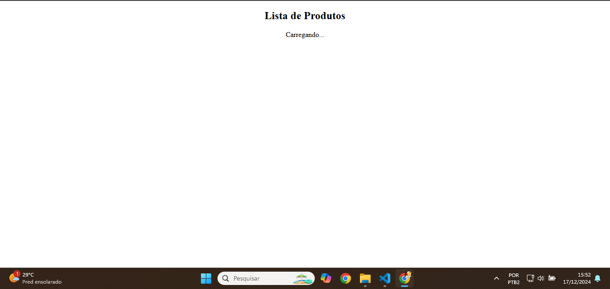
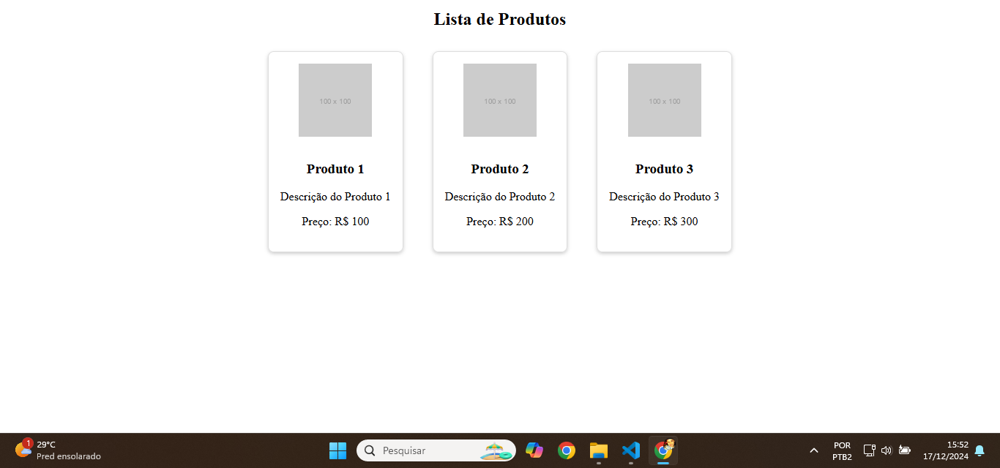

<h1>Screenshot of result</h1>

<h2>Descrição:</h2>

02/12 Desafio ( Catálogo com maps e promises ) da Aula 6 ( Promises, assincronia e map ) do curso de React.js na CoderHouse; Turma #63750 de 2024.

